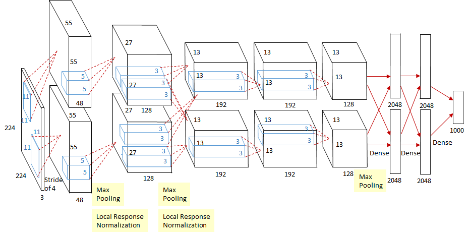

[![Contributors][contributors-shield]][contributors-url]
[![Forks][forks-shield]][forks-url]
[![Stargazers][stars-shield]][stars-url]
[![Issues][issues-shield]][issues-url]
[![MIT License][license-shield]][license-url]
[![LinkedIn][linkedin-shield]][linkedin-url]

<!-- PROJECT LOGO -->
<br />
<p align="center">
    

  <h2 align="center">AlexNet</h2>

  <p align="center">
    Tensorflow 2.x Implementation of the original AlexNet Paper
    <br />
    <a href="https://papers.nips.cc/paper/2012/file/c399862d3b9d6b76c8436e924a68c45b-Paper.pdf">Paper Link</a>
    ·
    <a href="https://nbviewer.jupyter.org/github/animikhaich/alexnet-tensorflow/blob/main/AlexNet_Prototype_Model.ipynb">Architecture</a>
    ·
    <a href="https://nbviewer.jupyter.org/github/animikhaich/alexnet-tensorflow/blob/main/AlexNet_Data_Loader.ipynb">Data Loader</a>
    ·
    <a href="https://nbviewer.jupyter.org/github/animikhaich/alexnet-tensorflow/blob/main/AlexNet_Trainer.ipynb">Model Trainer</a>
  </p>
</p>
<br>
<p align="center">
  
</p>
<!-- TABLE OF CONTENTS -->

## Table of Contents

- [Table of Contents](#table-of-contents)
- [About The Project](#about-the-project)
- [Features](#features)
- [Hardware Requirements](#hardware-requirements)
  - [Hardware used for Development and Testing](#hardware-used-for-development-and-testing)
  - [Minimum Hardware Requirements](#minimum-hardware-requirements)
- [Dataset Download & Setup](#dataset-download--setup)
  - [Dataset Download](#dataset-download)
  - [Raw/Source Dataset Directory Structure](#rawsource-dataset-directory-structure)
  - [Processed/Destination Dataset Directory Structure](#processeddestination-dataset-directory-structure)
- [References](#references)
- [Contributing](#contributing)
- [License](#license)
- [Contact](#contact)
    - [Animikh Aich](#animikh-aich)

<!-- ABOUT THE PROJECT -->

## About The Project

AlexNet is a Deep Learning Paper published in the year 2012 by Alex Krizhevsky (Hence, the name). It is one of the pioneer Deep Learning Publications which kick started the Deep Learning Research and proved its importance.

This implementation is a part of my learning where I take an attempt to implement Key Deep Learning Papers using Tensorflow or PyTorch.

The Original Literature Can be found here: [AlexNet Paper](https://papers.nips.cc/paper/2012/file/c399862d3b9d6b76c8436e924a68c45b-Paper.pdf)

Paper Explained Here: [ImageNet Classification with Deep Convolutional Neural Networks - YouTube](https://youtu.be/Nq3auVtvd9Q)

## Features

- **Tf.Data** - Optimized Tensorflow Data Pipelining using Tf.Data and Tensorflow Datasets
- **Vanilla Implementation** - I have taken an attempt to implement the original AlexNet Architecture as resembling the original literature as closely as possible.
- **Fused Implementation** - Since the Original Implementation was not very efficient for a single GPU training, hence, I have also implementation a Fused Model which closely resembles the original, but is a single straight network designed to run on a single GPU.
- **Mixed Precision Training** - The Implementation uses FP16 - Mixed Precision Training since that uses the Tensor Cores of the Nvidia GPU with Compute Capability 7.0 or higher.


## Hardware Requirements

[Nvidia GPU](https://www.nvidia.com/en-gb/graphics-cards/) for Training is recommended, However, it can work with CPUs as well (Not Recommended, ImageNet is Huge. It will probably take over a year to Train)

### Hardware used for Development and Testing

- **CPU:** AMD Ryzen 7 3700X - 8 Cores 16 Threads
- **GPU:** Nvidia GeForce RTX 2080 Ti 11 GB
- **RAM:** 32 GB DDR4 @ 3200 MHz
- **Storage:** 1 TB NVMe SSD
- **OS:** Ubuntu 20.04

### Minimum Hardware Requirements

- **CPU:** AMD/Intel 4 Core CPU (CPU will become a bottleneck here)
- **GPU:** Nvidia GeForce GTX 1660 6 GB (You can go lower, but I would not recommend it)
- **RAM:** 16 GB
- **Storage:** Minimum of 500 GB SSD (HDD is Not Recommended)
- **OS:** Any Linux Distribution

## Dataset Download & Setup

Enough HDD/SSD space is required for the following:

- Downloading Raw Dataset - 156.8 GB
- Convert to TFRecord and Store - 155.9 GB
- Total Storage Required - 312.7 GB

An SSD is recommended and a Mechanical HDD should be avoided since it will slow down the data loader significantly.

### Dataset Download

ImageNet Download Link: [Download ImageNet Dataset](https://image-net.org/download-images)

- Download Train Images (Required): `ILSVRC2012_img_train.tar` - Size 137.7 GB
- Download Val Images (Required): `ILSVRC2012_img_val.tar` - Size 6.3 GB
- Download Train Images (Optional): `ILSVRC2012_img_test.tar` - Size 12.7 GB

### Raw/Source Dataset Directory Structure
Download the dataset from the above link and put it in the folder like shown:

```sh
imagenet2012/
├── ILSVRC2012_img_test.tar
├── ILSVRC2012_img_train.tar
└── ILSVRC2012_img_val.tar
```

### Processed/Destination Dataset Directory Structure
Create another folder and create the folders `data`, `download` & `extracted` like shown:

```sh
imagenet/
├── data/
├── downloaded/
└── extracted/
```

## References

- Source Literature: [AlexNet Paper](https://papers.nips.cc/paper/2012/file/c399862d3b9d6b76c8436e924a68c45b-Paper.pdf)
- Paper Explanation: [ImageNet Classification with Deep Convolutional Neural Networks - YouTube](https://youtu.be/Nq3auVtvd9Q)
- Download the Dataset by Signing up with your Institution Email Addreess: [Download ImageNet Dataset](https://image-net.org/download-images)
- Tensorflow Datasets ImageNet2012 Dataset: [API Docs](https://www.tensorflow.org/datasets/catalog/imagenet2012)
- Efficient Data Pipelining using: [Tf.Data](https://www.tensorflow.org/guide/data)
- Tf.Data Training and Testing Split: [Slice & Split Docs](https://www.tensorflow.org/datasets/splits)
- Data Loader Template taken from my own Repository: [Zero Coding Tf Classifier](https://github.com/animikhaich/Zero-Code-TF-Classifier/blob/main/core/data_loader.py)

## Contributing

Contributions are what make the open source community such an amazing place to be learn, inspire, and create. Any contributions you make are **greatly appreciated**.

1. Fork the Project
2. Create your Feature Branch (`git checkout -b feature/AmazingFeature`)
3. Commit your Changes (`git commit -m 'Add some AmazingFeature'`)
4. Push to the Branch (`git push origin feature/AmazingFeature`)
5. Open a Pull Request

## License

Distributed under the [GNU AGPL V3 License](https://choosealicense.com/licenses/agpl-3.0/). See [LICENSE](LICENSE) for more information.

## Contact

#### Animikh Aich

- Website: [Animikh Aich - Website](http://www.animikh.me/)
- LinkedIn: [animikh-aich](https://www.linkedin.com/in/animikh-aich/)
- Email: [animikhaich@gmail.com](mailto:animikhaich@gmail.com)
- Twitter: [@AichAnimikh](https://twitter.com/AichAnimikh)


[contributors-shield]: https://img.shields.io/github/contributors/animikhaich/alexnet-tensorflow.svg?style=flat-square
[contributors-url]: https://github.com/animikhaich/alexnet-tensorflow/graphs/contributors
[forks-shield]: https://img.shields.io/github/forks/animikhaich/alexnet-tensorflow.svg?style=flat-square
[forks-url]: https://github.com/animikhaich/alexnet-tensorflow/network/members
[stars-shield]: https://img.shields.io/github/stars/animikhaich/alexnet-tensorflow.svg?style=flat-square
[stars-url]: https://github.com/animikhaich/alexnet-tensorflow/stargazers
[issues-shield]: https://img.shields.io/github/issues/animikhaich/alexnet-tensorflow.svg?style=flat-square
[issues-url]: https://github.com/animikhaich/alexnet-tensorflow/issues
[license-shield]: https://img.shields.io/github/license/animikhaich/alexnet-tensorflow.svg?style=flat-square
[license-url]: https://github.com/animikhaich/alexnet-tensorflow/blob/main/LICENSE
[linkedin-shield]: https://img.shields.io/badge/-LinkedIn-black.svg?style=flat-square&logo=linkedin&colorB=555
[linkedin-url]: https://linkedin.com/in/animikh-aich/
